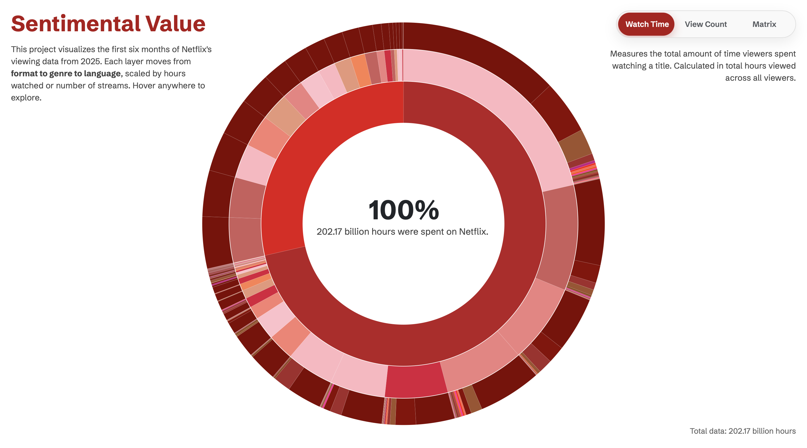
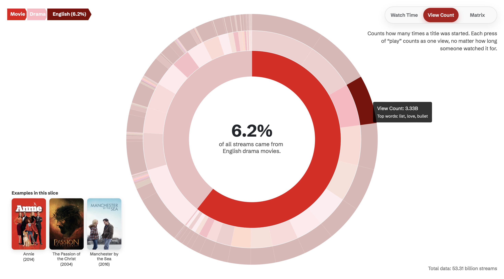
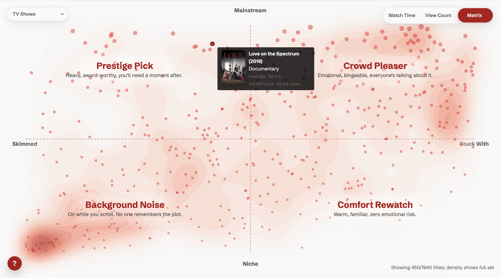
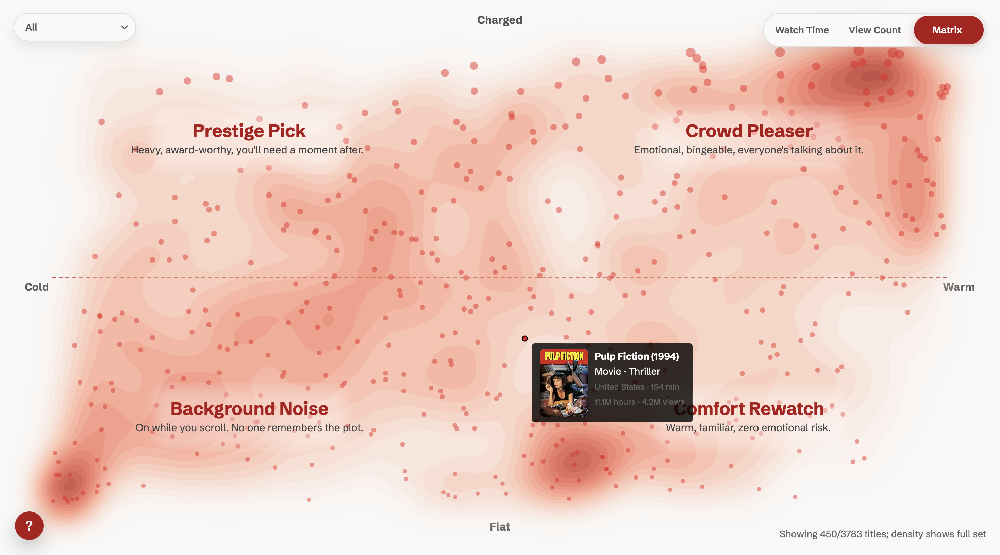

# Sentimental Value

Sentimental Value breaks Netflix’s first six months of 2025 into three parts: watch time, view count, and a sentiment matrix built from emotional valence and narrative intensity. Valence runs cold to warm. Intensity runs flat to charged. Plot every title on those two lines and the patterns show up fast: the heavy prestige stuff, the easy crowd-pleasers, the background filler, and the comfort rewatches.

## Sources

- Internal Netflix viewing metrics (watch time, view count, 2025 H1)
- Enriched title metadata from APIs: [TMDB](https://www.themoviedb.org/?language=en-US) + [OMDb](https://www.omdbapi.com) (genres, runtime, language, country, posters)
- Manual keyword normalization for sentiment mapping and title cleaning

## WIP & Sketches

- [Quantiative draft](https://github.com/derinsavasan/info-aesthetics/tree/main/exercises/netflix-sunburst-quant), [Qualitative draft](https://github.com/derinsavasan/info-aesthetics/tree/main/exercises/netflix-sunburst-qual), [Geospatial draft](https://github.com/derinsavasan/info-aesthetics/tree/main/exercises/imdb-map-me)
- [Sketches PDF](https://github.com/derinsavasan/info-aesthetics/blob/main/exercises/netflix-sketches.pdf)

## Screenshots

