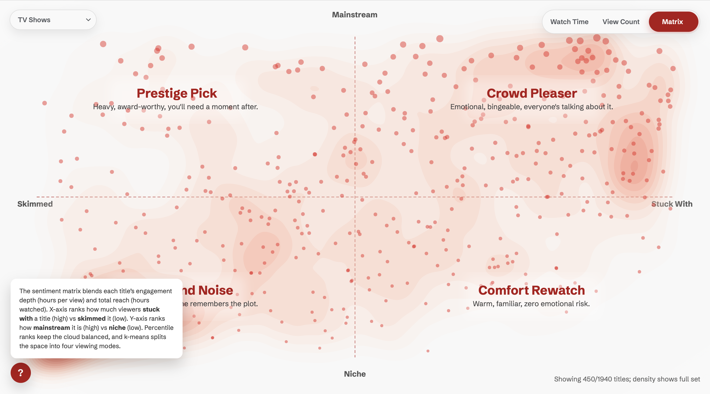

# Sentimental Value

Sentimental Value breaks Netflix’s first six months of 2025 into three parts: watch time, view count, and a sentiment matrix built from engagement depth vs. reach. The matrix ranks titles by hours-per-view (x-axis: skimmed → stuck with) and total hours (y-axis: niche → mainstream), then clusters the scatter into four viewing modes: Prestige Pick, Crowd Pleaser, Background Noise, and Comfort Rewatch.

## Sources

- Internal Netflix viewing metrics (watch time, view count, 2025 H1)
- Enriched title metadata from APIs: [TMDB](https://www.themoviedb.org/?language=en-US) + [OMDb](https://www.omdbapi.com) (genres, runtime, language, country, posters)
- Manual keyword normalization for sentiment mapping and title cleaning

## WIP & Sketches

- [Quantiative draft](https://github.com/derinsavasan/info-aesthetics/tree/main/exercises/netflix-sunburst-quant), [Qualitative draft](https://github.com/derinsavasan/info-aesthetics/tree/main/exercises/netflix-sunburst-qual), [Geospatial draft](https://github.com/derinsavasan/info-aesthetics/tree/main/exercises/imdb-map-me)
- [Sketches PDF](https://github.com/derinsavasan/info-aesthetics/blob/main/exercises/netflix-sketches.pdf)

## Screenshots

